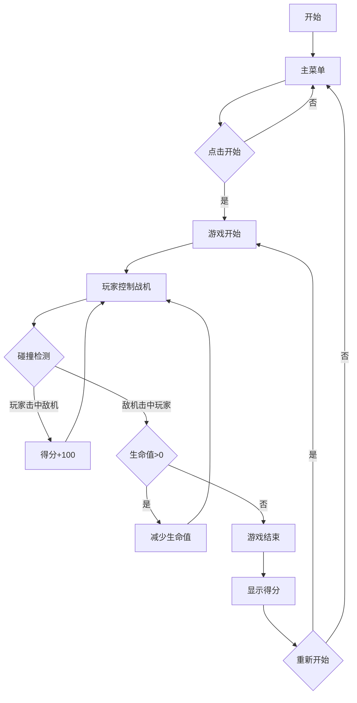

## 1. Product Overview
一款经典的2D射击类网页游戏，玩家操控战机消灭敌人，躲避敌方攻击，获取道具增强火力。
- 核心玩法：飞行射击、敌机消灭、道具收集、BOSS战
- 目标用户：休闲游戏爱好者，喜欢经典街机风格的玩家

## 2. Core Features

### 2.1 User Roles
| Role | Registration Method | Core Permissions |
|------|---------------------|------------------|
| Player | None (直接开始游戏) | 操控战机、射击、收集道具 |

### 2.2 Feature Module
1. **主菜单页面**: 游戏标题、开始按钮、最高分显示
2. **游戏页面**: 战机控制、敌机生成、碰撞检测、得分系统
3. **游戏结束页面**: 得分展示、重新开始按钮

### 2.3 Page Details
| Page Name | Module Name | Feature description |
|-----------|-------------|---------------------|
| 主菜单 | 标题区 | 游戏名称、副标题、背景动画 |
| 主菜单 | 控制区 | 开始游戏按钮、最高分显示 |
| 游戏页面 | 玩家战机 | 键盘/鼠标控制移动、发射子弹 |
| 游戏页面 | 敌机系统 | 多种敌机类型、不同移动轨迹 |
| 游戏页面 | 道具系统 | 火力增强、护盾、生命恢复 |
| 游戏页面 | 得分系统 | 实时得分、连击奖励 |
| 游戏结束 | 结算区 | 最终得分、最高分更新 |

## 3. Core Process

## 4. User Interface Design
### 4.1 Design Style
- 主色调：深蓝色背景配合霓虹色(青色、紫色、粉色)
- 按钮：圆角矩形，发光效果
- 字体：像素风格字体，科技感
- 布局：全屏游戏画布，顶部状态栏
- 图标：简约几何图形

### 4.2 Page Design Overview
| Page Name | Module Name | UI Elements |
|-----------|-------------|-------------|
| 主菜单 | 标题区 | 大标题、副标题、背景星空动画 |
| 主菜单 | 控制区 | 开始按钮(蓝色发光)、最高分显示 |
| 游戏页面 | 状态栏 | 生命值、得分、等级 |
| 游戏页面 | 游戏画布 | 战机、敌机、子弹、道具 |
| 游戏结束 | 结算区 | 最终得分、最高分、重新开始按钮 |

### 4.3 Responsiveness
- 桌面端：键盘方向键/鼠标控制
- 移动端：触摸滑动控制
- 自适应画布大小

### 4.4 游戏特色
- 多种敌机类型：普通敌机、精英敌机、BOSS
- 道具系统：火力增强、护盾保护、生命恢复
- 连击系统：连续击杀获得额外分数
- 难度递增：随时间推移敌机速度和数量增加