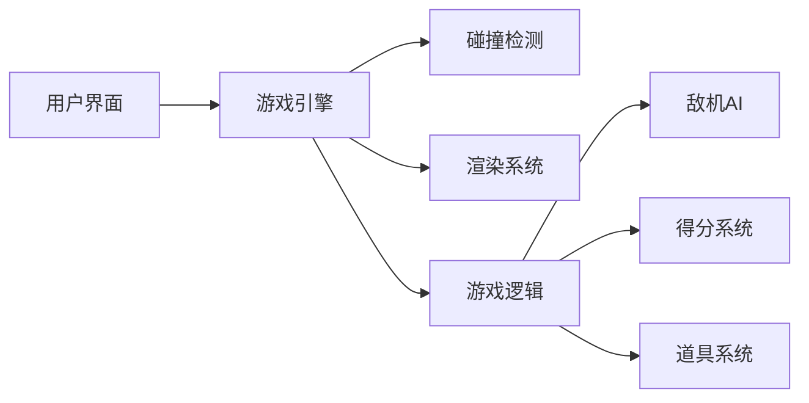
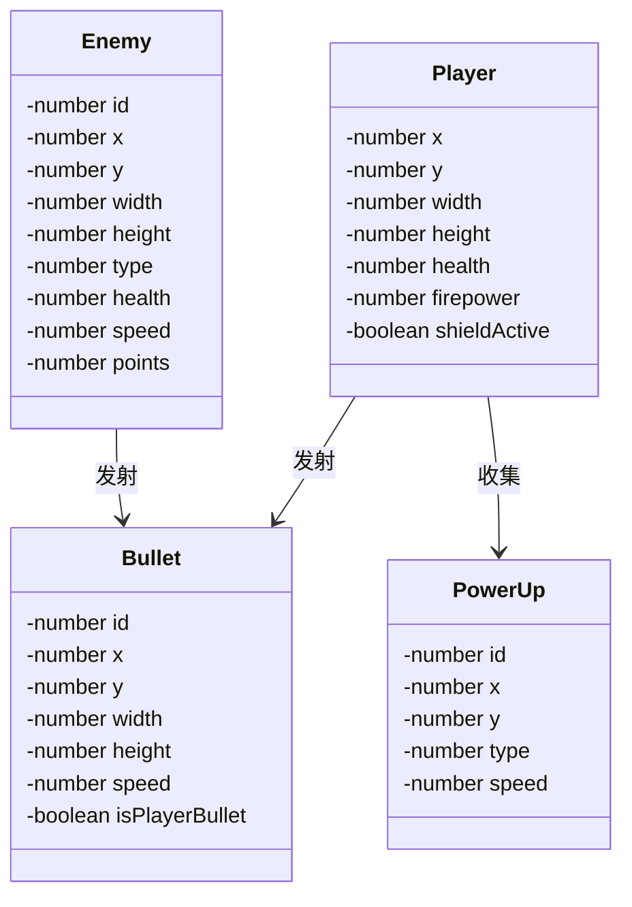

## 1. Architecture Design

## 2. Technology Description
- Frontend: React@18 + TypeScript + tailwindcss@3 + vite
- 游戏渲染：HTML5 Canvas API
- 状态管理：React useState/useReducer
- 样式：Tailwind CSS 3

## 3. Route Definitions
| Route | Purpose |
|-------|---------|
| / | 主菜单页面 |
| /game | 游戏页面 |

## 4. API Definitions
无需后端API，纯前端游戏

## 5. Server Architecture Diagram
无需后端服务器

## 6. Data Model
### 6.1 Data Model Definition

### 6.2 游戏对象属性

**Player(玩家战机)**
| 属性 | 类型 | 说明 |
|------|------|------|
| x | number | X坐标 |
| y | number | Y坐标 |
| width | number | 宽度 |
| height | number | 高度 |
| health | number | 生命值(1-3) |
| firepower | number | 火力等级(1-3) |
| shieldActive | boolean | 护盾是否激活 |

**Enemy(敌机)**
| 属性 | 类型 | 说明 |
|------|------|------|
| id | number | 唯一标识 |
| x | number | X坐标 |
| y | number | Y坐标 |
| width | number | 宽度 |
| height | number | 高度 |
| type | number | 类型(1-普通,2-精英,3-BOSS) |
| health | number | 生命值 |
| speed | number | 移动速度 |
| points | number | 击杀得分 |

**Bullet(子弹)**
| 属性 | 类型 | 说明 |
|------|------|------|
| id | number | 唯一标识 |
| x | number | X坐标 |
| y | number | Y坐标 |
| width | number | 宽度 |
| height | number | 高度 |
| speed | number | 飞行速度 |
| isPlayerBullet | boolean | 是否玩家子弹 |

**PowerUp(道具)**
| 属性 | 类型 | 说明 |
|------|------|------|
| id | number | 唯一标识 |
| x | number | X坐标 |
| y | number | Y坐标 |
| type | number | 类型(1-火力,2-护盾,3-生命) |
| speed | number | 下落速度 |

## 7. 核心逻辑说明

### 7.1 游戏循环
- 使用requestAnimationFrame实现60fps游戏循环
- 每帧执行：更新位置、碰撞检测、渲染

### 7.2 碰撞检测
- 使用矩形碰撞检测算法
- 检测玩家子弹与敌机
- 检测敌机子弹与玩家
- 检测玩家与道具

### 7.3 敌机生成
- 根据游戏时间动态调整生成频率
- 普通敌机随机生成
- 每30秒生成精英敌机
- 每60秒生成BOSS

### 7.4 得分系统
- 普通敌机：100分
- 精英敌机：500分
- BOSS：2000分
- 连击奖励：连续击杀获得额外50%分数