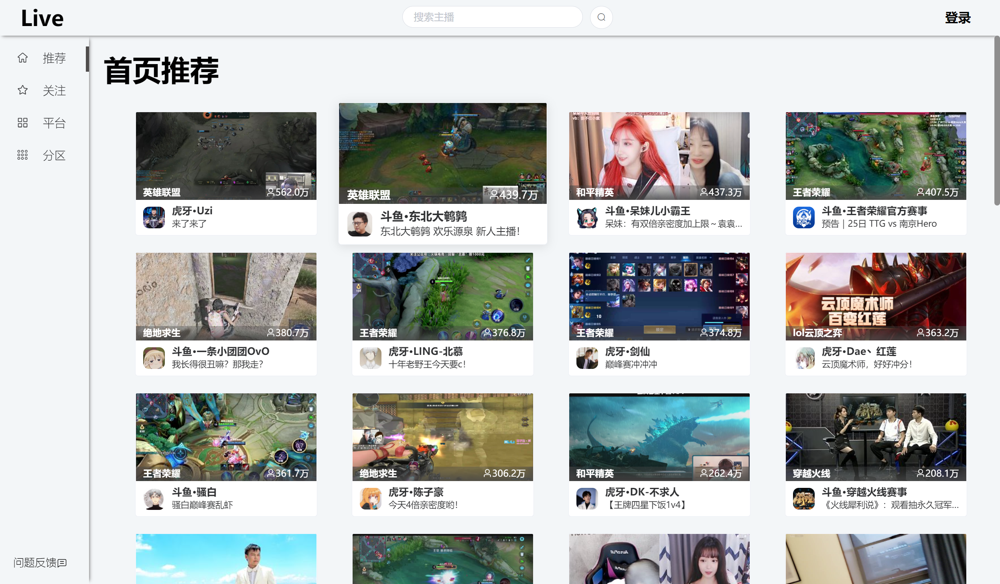
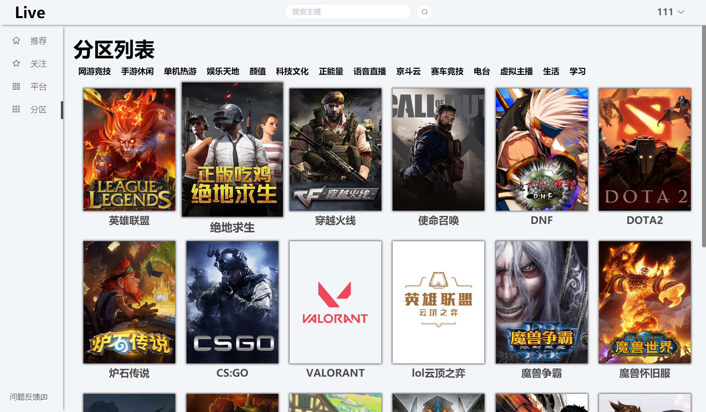
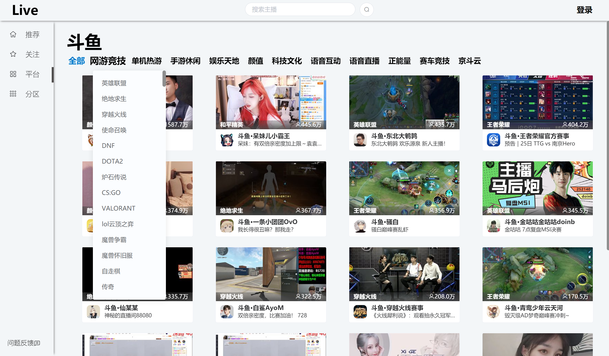
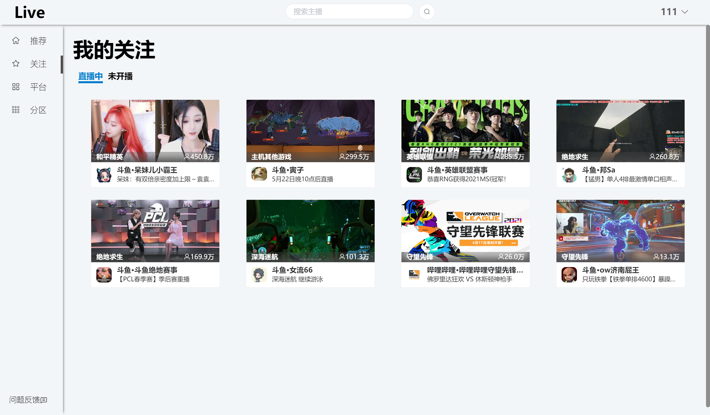
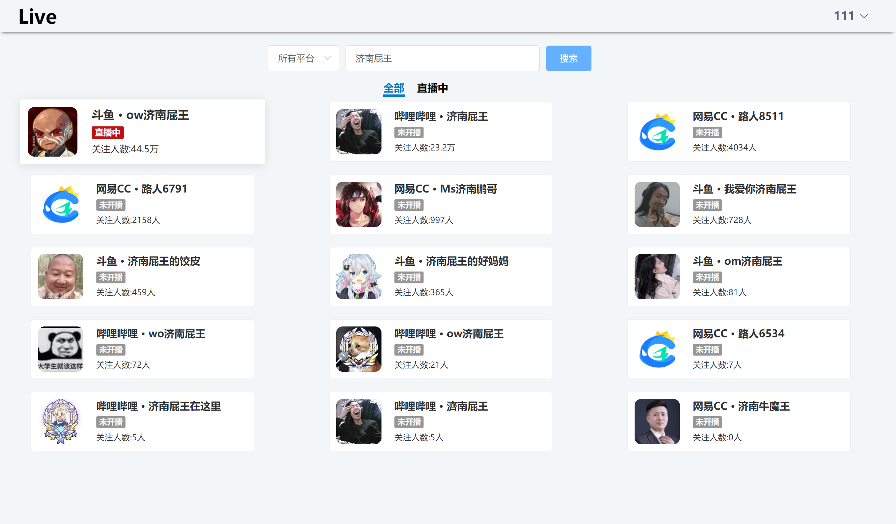
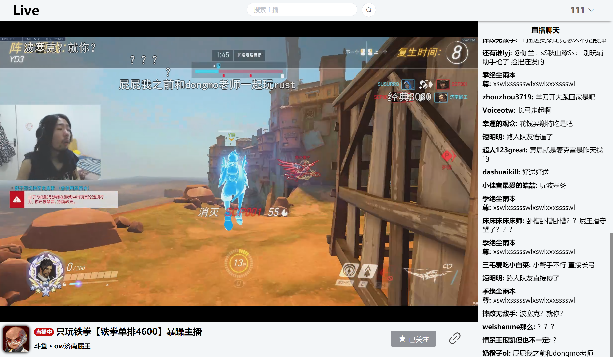

<<<<<<< HEAD
# web
web
=======

# JustLive-Web

:tv:一个整合国内多个直播平台内容的网站，基于vue.js开发。

此项目为JustLive Web端💻

 📱 Android版 [JustLive-Android](https://github.com/guyijie1211/JustLive-Android)

后端项目地址    [JustLive-Api](https://github.com/guyijie1211/JustLive-Api)

QQ交流群：645962588

网站页面   &#x1F449; [live.yj1211.work](http://live.yj1211.work) &#x1F448;

#### 功能

✔	多平台直播信息获取

✔	关注直播间

✔	弹幕获取

✔	直播间搜索

## 直播支持

虎牙、斗鱼、BILIBILI直播、网易cc（cc暂无清晰度切换）

直播源获取参考	[wbt5/real-url](https://github.com/wbt5/real-url)

播放器使用	[zhw2590582/ArtPlayer](https://github.com/zhw2590582/ArtPlayer)

## 弹幕支持(暂不支持弹幕发送)

斗鱼、BILIBILI直播、虎牙

斗鱼弹幕协议参考	[斗鱼开放平台](https://open.douyu.com/source/api/63)

BILIBILI直播弹幕协议参考	[lovelyyoshino/Bilibili-Live-API](https://github.com/lovelyyoshino/Bilibili-Live-API)

## 更新记录
**2022/08/11**  因企鹅电竞关站，先已取消支持该直播源

**2021/07/28**  更换弹幕插件, 优化弹幕体验

**2021/07/27**  增加企鹅电竞直播源

**2021/07/09**  测试功能：电视节目直播

**2021/07/07**  增加直播页面弹幕列表、房间列表和分区列表的动画效果

**2021/06/29**  修复斗鱼房间人数达到“亿”后导致无法获取房间信息的问题

**2021/06/28**  增加弹幕屏蔽功能（支持用户等级和弹幕内容屏蔽）

**2021/06/27**  修复虎牙接口更新导致的问题

**2021/06/08**  网站升级Https协议

**2021/06/04**  增加虎牙弹幕获取支持

## 页面

>>>>>>> 0655dc7 (first commit)
